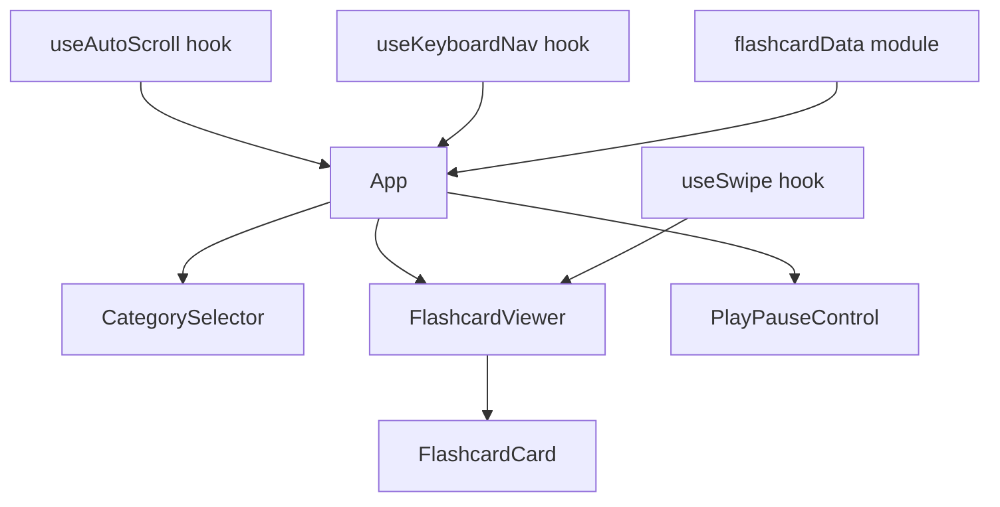
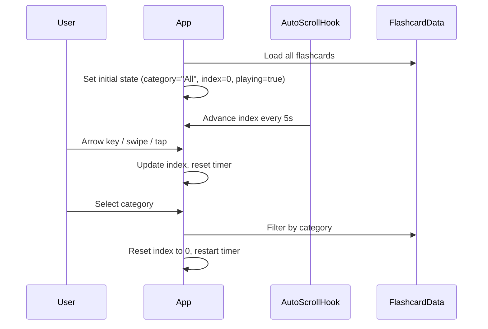

# Design Document: Kids Image Flashcards

## Overview

A single-page React application that displays large, colorful flashcard images to help young children learn to identify everyday items. The app presents one flashcard at a time with automatic cycling (every 5 seconds), manual navigation (keyboard arrows, touch/swipe), category filtering, and pause/resume controls.

The application is built with React + TypeScript using Vite as the build tool. It is entirely client-side with no backend — the image library is bundled as static assets. The design prioritizes simplicity, accessibility, and responsiveness across phones, tablets, and desktops.

### Key Design Decisions

- **React + TypeScript + Vite**: Lightweight, fast dev experience, strong typing for correctness.
- **No backend**: All data (image paths, labels, categories) is defined in a static JSON-like data module. Images are bundled or served from `/public`.
- **CSS Modules or plain CSS**: Minimal styling approach — no heavy UI framework needed for a child-focused app.
- **fast-check for property-based testing**: Well-maintained PBT library for TypeScript/JavaScript.
- **Vitest for unit testing**: Pairs naturally with Vite.

## Architecture

The app follows a simple component-based architecture with React hooks managing state.



### Data Flow



## Components and Interfaces

### Components

**App** — Root component. Owns the application state: current index, selected category, play/pause status. Wires up keyboard navigation and auto-scroll hooks.

**FlashcardViewer** — Displays the current flashcard image and label. Handles touch/swipe gestures via `useSwipe`. Shows a placeholder if the image fails to load.

**FlashcardCard** — Presentational component rendering a single flashcard: image element + label text. Handles image error state.

**CategorySelector** — Renders a row of category buttons including "All". Highlights the active category.

**PlayPauseControl** — A toggle button showing play or pause icon. Indicates current auto-scroll state.

### Custom Hooks

**useAutoScroll(isPlaying: boolean, onAdvance: () => void, delay: number)** — Sets up an interval that calls `onAdvance` every `delay` ms when `isPlaying` is true. Cleans up on unmount or when paused.

**useKeyboardNav(onNext: () => void, onPrev: () => void)** — Attaches `keydown` listener for ArrowRight → `onNext`, ArrowLeft → `onPrev`.

**useSwipe(ref: RefObject, onSwipeLeft: () => void, onSwipeRight: () => void, onTap: () => void)** — Tracks touch start/end positions on the given element. Swipe left → `onSwipeLeft`, swipe right → `onSwipeRight`, tap (minimal movement) → `onTap`.

### Interfaces

```typescript
interface Flashcard {
  id: string;
  name: string;          // e.g. "Apple"
  imageSrc: string;      // path to image asset
  category: Category;
}

type Category = "Fruits" | "Vegetables" | "Animals";

interface FlashcardDataModule {
  getAllFlashcards(): Flashcard[];
  getCategories(): Category[];
  getFlashcardsByCategory(category: Category): Flashcard[];
}
```

### Core Logic Functions (pure, testable)

```typescript
// Navigate to next index with wrapping
function nextIndex(current: number, length: number): number;

// Navigate to previous index with wrapping
function prevIndex(current: number, length: number): number;

// Filter flashcards by category (or return all if category is "All")
function filterByCategory(flashcards: Flashcard[], category: Category | "All"): Flashcard[];

// Validate a flashcard has required fields
function isValidFlashcard(card: Flashcard): boolean;
```

## Data Models

### Flashcard Data

The flashcard data is a static TypeScript module exporting an array of `Flashcard` objects. No database or API is involved.

```typescript
// src/data/flashcards.ts
export const flashcards: Flashcard[] = [
  { id: "fruit-apple", name: "Apple", imageSrc: "/images/fruits/apple.png", category: "Fruits" },
  { id: "fruit-banana", name: "Banana", imageSrc: "/images/fruits/banana.png", category: "Fruits" },
  // ... at least 5 per category, 3 categories minimum
];
```

### Application State

```typescript
interface AppState {
  allFlashcards: Flashcard[];       // full dataset
  filteredFlashcards: Flashcard[];  // after category filter
  currentIndex: number;             // index into filteredFlashcards
  selectedCategory: Category | "All";
  isPlaying: boolean;               // auto-scroll active
}
```

### Image Assets

Images are stored in `/public/images/{category}/` as PNG or SVG files. Each image filename matches the flashcard `id`. The app uses standard `` tags with `onError` handlers for graceful fallback.


## Correctness Properties

*A property is a characteristic or behavior that should hold true across all valid executions of a system — essentially, a formal statement about what the system should do. Properties serve as the bridge between human-readable specifications and machine-verifiable correctness guarantees.*

### Property 1: Next index wraps correctly

*For any* valid current index (0 ≤ current < length) and any list length > 0, `nextIndex(current, length)` should return `(current + 1) % length`. In particular, when current is the last index, it wraps to 0.

**Validates: Requirements 2.1, 2.2, 3.1, 3.3**

### Property 2: Previous index wraps correctly

*For any* valid current index (0 ≤ current < length) and any list length > 0, `prevIndex(current, length)` should return `(current - 1 + length) % length`. In particular, when current is 0, it wraps to the last index.

**Validates: Requirements 3.2, 3.4**

### Property 3: Every flashcard has a non-empty name label

*For any* flashcard in the image library, the `name` field must be a non-empty, non-whitespace string, ensuring every image is associated with a readable label.

**Validates: Requirements 1.3, 4.3**

### Property 4: Category filter returns only matching flashcards

*For any* array of flashcards and any selected category (including "All"), `filterByCategory` should return exactly the flashcards whose category matches the selection. When "All" is selected, the result should equal the full input array. When a specific category is selected, every returned flashcard must belong to that category and no matching flashcard from the input should be missing.

**Validates: Requirements 5.2, 5.3**

### Property 5: Swipe direction detection

*For any* pair of touch coordinates (startX, endX) where the absolute horizontal delta exceeds the swipe threshold, the detected direction should be "left" when endX < startX and "right" when endX > startX. The direction must be consistent regardless of the Y coordinates.

**Validates: Requirements 7.1, 7.2**

### Property 6: Tap detection for small touch movements

*For any* pair of touch coordinates (start, end) where the absolute horizontal delta is below the swipe threshold, the gesture should be classified as a "tap" rather than a swipe, regardless of the specific coordinates.

**Validates: Requirements 7.3**

### Property 7: Image error produces placeholder with item name

*For any* flashcard whose image fails to load, the rendered output must include a placeholder element that contains the flashcard's `name` text, ensuring the child still sees the label even when the image is unavailable.

**Validates: Requirements 9.1**

## Error Handling

### Image Load Failures

- Each `` element uses an `onError` handler that sets a local `imageError` state on the `FlashcardCard` component.
- When `imageError` is true, the component renders a styled placeholder `<div>` with the item name in large text and a generic icon (e.g., a question mark or camera icon).
- The auto-scroll timer is decoupled from image loading — it operates on index state only, so a failed image never blocks advancement.

### All Images Failing

- The `FlashcardViewer` tracks how many flashcards in the current filtered set have errored.
- If all flashcards in the current category report image errors, a full-screen message is displayed: "Oops! Pictures aren't available right now. Try another category."
- The category selector remains accessible so the user can switch categories.

### Empty Category After Filter

- If `filterByCategory` returns an empty array (shouldn't happen with valid data, but defensive), the app displays a friendly "No flashcards found" message instead of crashing.

### Invalid Data

- The `isValidFlashcard` function validates each flashcard entry at load time. Invalid entries (missing name, missing imageSrc, missing category) are filtered out with a console warning.

## Testing Strategy

### Unit Tests (Vitest)

Unit tests cover specific examples, edge cases, and integration points:

- **Data validation**: Verify the image library has ≥ 3 categories, ≥ 5 items per category (Requirements 4.1, 4.2).
- **Initial state**: App defaults to "All" category on first load (Requirement 5.4).
- **Timer reset on manual navigation**: After a manual nav event, the auto-scroll timer resets (Requirement 2.3).
- **Pause/play toggle**: Activating pause stops the timer; activating play restarts it (Requirements 8.2, 8.3).
- **Pause/play icon state**: The control icon reflects the current isPlaying state (Requirement 8.4).
- **Auto-scroll continues on image error**: Timer keeps advancing even when an image fails (Requirement 9.2).
- **All images failed message**: When every image in a category errors, a fallback message is shown (Requirement 9.3).
- **Category selector renders all categories**: The selector includes all categories plus "All" (Requirement 5.1).
- **Single flashcard displayed**: Only one flashcard is rendered at a time (Requirement 1.1).

### Property-Based Tests (fast-check + Vitest)

Each correctness property from the design is implemented as a single property-based test using `fast-check`. Each test runs a minimum of 100 iterations.

Each test is tagged with a comment in the format:
**Feature: kids-image-flashcards, Property {number}: {property title}**

| Property | Test Description | Generator Strategy |
|----------|------------------|--------------------|
| Property 1: Next index wraps correctly | Generate random (index, length) pairs where 0 ≤ index < length, verify `nextIndex` equals `(index + 1) % length` | `fc.integer` for index and length with constraints |
| Property 2: Previous index wraps correctly | Generate random (index, length) pairs, verify `prevIndex` equals `(index - 1 + length) % length` | `fc.integer` for index and length with constraints |
| Property 3: Every flashcard has a non-empty name | Generate random flashcard objects, verify `isValidFlashcard` rejects those with empty/whitespace names | `fc.record` with `fc.string` for name field |
| Property 4: Category filter correctness | Generate random flashcard arrays and a category, verify filter output contains only matching items and no matching items are missing | `fc.array(flashcardArbitrary)` + `fc.constantFrom(...categories)` |
| Property 5: Swipe direction detection | Generate random (startX, endX) pairs with delta > threshold, verify direction matches sign of delta | `fc.integer` for coordinates |
| Property 6: Tap detection | Generate random (startX, endX) pairs with delta < threshold, verify gesture is classified as tap | `fc.integer` for coordinates with small delta constraint |
| Property 7: Image error placeholder | Generate random flashcard names, simulate error state, verify placeholder contains the name | `fc.string` for flashcard names (non-empty) |

### Testing Libraries

- **Vitest**: Test runner and assertion library (pairs with Vite)
- **fast-check**: Property-based testing library for TypeScript
- **@testing-library/react**: Component rendering and DOM assertions
- **jsdom**: Browser environment simulation for Vitest
