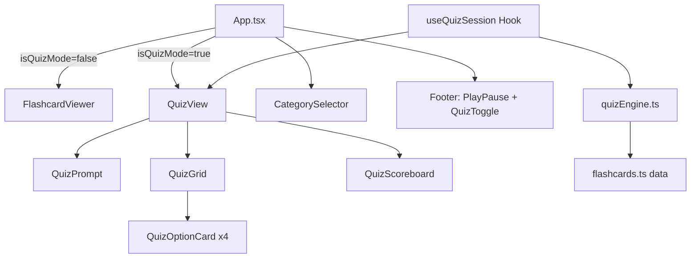
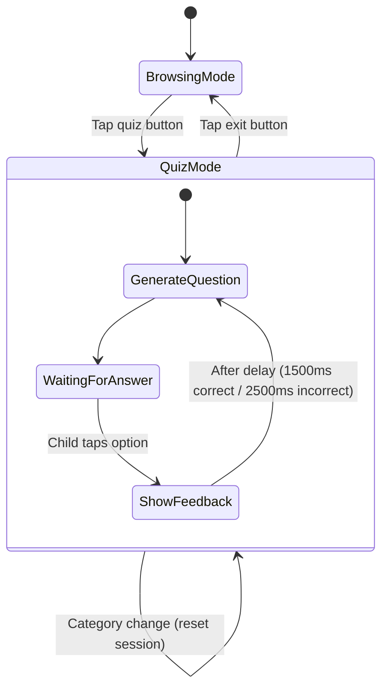

# Design Document: Quiz Mode

## Overview

Quiz Mode adds a word-to-image quiz experience to the Kids Image Flashcards app. A prompt word is displayed at the top of the screen and the child taps the matching image from a 2×2 grid of four options. The feature integrates into the existing app shell — activated via a footer button, respecting the current category filter, and providing immediate visual feedback with auto-progression.

The design prioritizes a clean separation between quiz logic (question generation, answer evaluation, scoring) and quiz presentation (grid layout, feedback animations). The quiz engine is a pure-logic module with no React dependencies, making it straightforward to test with property-based testing. The quiz view is a set of React components that consume the engine's output.

### Key Design Decisions

1. **Pure-logic Quiz Engine**: All question generation, distractor selection, and answer evaluation live in a standalone TypeScript module (`src/quiz/quizEngine.ts`) with no React imports. This enables thorough unit and property-based testing without DOM dependencies.

2. **Custom Hook for Session State**: A `useQuizSession` hook manages the mutable session lifecycle (current question, score, progression timers) and bridges the engine to React components.

3. **Reuse existing data layer**: The quiz draws from the same `flashcards.ts` data and `Category` type. No new data sources are needed.

4. **Inline styles**: Consistent with the existing codebase pattern — all components use `Record<string, React.CSSProperties>` style objects.

## Architecture



### Component Hierarchy

- **App.tsx** — gains `isQuizMode` state; conditionally renders `FlashcardViewer` or `QuizView` in the main area. Footer shows `PlayPauseControl` only when not in quiz mode, and always shows `QuizToggleButton`.
- **QuizView** — top-level quiz component; composes `QuizPrompt`, `QuizGrid`, and `QuizScoreboard`.
- **QuizPrompt** — renders the prompt word in large text.
- **QuizGrid** — renders the 2×2 grid of `QuizOptionCard` components.
- **QuizOptionCard** — a single tappable image option with feedback border states.
- **QuizScoreboard** — displays question number and running score.
- **QuizToggleButton** — footer button to enter/exit quiz mode.
- **useQuizSession** — custom hook managing quiz session state, delegating to the engine.
- **quizEngine.ts** — pure functions for question generation and answer evaluation.

## Components and Interfaces

### quizEngine.ts (Pure Logic Module)

```typescript
// src/quiz/quizEngine.ts

import type { Flashcard, Category } from '../types';

export interface QuizQuestion {
  promptWord: string;           // The name to display as the question
  correctOption: QuizOption;    // The correct answer
  options: QuizOption[];        // All 4 options (shuffled, includes correct)
}

export interface QuizOption {
  flashcardId: string;
  name: string;
  imageSrc: string;
  category: Category;
}

/**
 * Generate a quiz question from the given flashcard pool.
 * - Selects a random correct answer from `pool`
 * - Picks 3 distractors with unique names, preferring same-category
 * - Falls back to other categories if same-category has < 4 unique names
 * - Shuffles option positions
 * - `previousId` is excluded from being the correct answer (no immediate repeats)
 */
export function generateQuestion(
  pool: Flashcard[],
  allFlashcards: Flashcard[],
  previousId?: string
): QuizQuestion;

/**
 * Evaluate whether the selected option is correct.
 * Returns true if selectedId matches the correct option's flashcardId.
 */
export function evaluateAnswer(
  question: QuizQuestion,
  selectedId: string
): boolean;

/**
 * Get unique flashcard names from a list, returning one flashcard per unique name.
 * Used internally for distractor selection.
 */
export function getUniqueByName(flashcards: Flashcard[]): Flashcard[];
```

### useQuizSession Hook

```typescript
// src/quiz/useQuizSession.ts

export interface QuizSessionState {
  currentQuestion: QuizQuestion | null;
  questionNumber: number;
  score: number;
  totalAnswered: number;
  selectedOptionId: string | null;
  isCorrect: boolean | null;
  isTransitioning: boolean;  // true during the delay before next question
}

export interface UseQuizSessionReturn {
  state: QuizSessionState;
  handleAnswer: (selectedId: string) => void;
  resetSession: () => void;
}

export function useQuizSession(
  filteredFlashcards: Flashcard[],
  allFlashcards: Flashcard[]
): UseQuizSessionReturn;
```

### QuizView Component

```typescript
// src/components/QuizView.tsx

export interface QuizViewProps {
  filteredFlashcards: Flashcard[];
  allFlashcards: Flashcard[];
}

export function QuizView({ filteredFlashcards, allFlashcards }: QuizViewProps): JSX.Element;
```

### QuizOptionCard Component

```typescript
// src/components/QuizOptionCard.tsx

export interface QuizOptionCardProps {
  option: QuizOption;
  isSelected: boolean;
  isCorrectAnswer: boolean;
  isRevealed: boolean;    // true after any selection is made
  disabled: boolean;
  onSelect: (id: string) => void;
}

export function QuizOptionCard(props: QuizOptionCardProps): JSX.Element;
```

### QuizToggleButton Component

```typescript
// src/components/QuizToggleButton.tsx

export interface QuizToggleButtonProps {
  isQuizMode: boolean;
  onToggle: () => void;
}

export function QuizToggleButton({ isQuizMode, onToggle }: QuizToggleButtonProps): JSX.Element;
```

### App.tsx Changes

```typescript
// New state in App.tsx
const [isQuizMode, setIsQuizMode] = useState(false);

// Category change resets quiz session (handled by useQuizSession reacting to filteredFlashcards change)
// Footer renders QuizToggleButton alongside PlayPauseControl
// Main area conditionally renders FlashcardViewer or QuizView
```

## Data Models

### Existing Types (unchanged)

```typescript
// src/types/index.ts — no changes needed
export interface Flashcard {
  id: string;
  name: string;
  imageSrc: string;
  category: Category;
  subtitle?: string;
  exampleImageSrc?: string;
}

export type Category = "Fruits" | "Vegetables" | ... | "Toys";
```

### New Types

```typescript
// QuizQuestion and QuizOption defined in quizEngine.ts (see above)

// QuizSessionState defined in useQuizSession.ts (see above)
```

### State Flow



### Score State

| Field | Type | Initial | Updated When |
|-------|------|---------|-------------|
| `questionNumber` | `number` | `1` | Next question generated |
| `score` | `number` | `0` | Correct answer given |
| `totalAnswered` | `number` | `0` | Any answer given |
| `selectedOptionId` | `string \| null` | `null` | Child taps an option |
| `isCorrect` | `boolean \| null` | `null` | Answer evaluated |
| `isTransitioning` | `boolean` | `false` | During delay before next question |

Score and session state reset when: quiz mode is exited, or category is changed during quiz mode.


## Correctness Properties

*A property is a characteristic or behavior that should hold true across all valid executions of a system — essentially, a formal statement about what the system should do. Properties serve as the bridge between human-readable specifications and machine-verifiable correctness guarantees.*

### Property 1: Question structure invariant

*For any* pool of flashcards containing at least 4 unique names, `generateQuestion(pool, allFlashcards)` shall return a `QuizQuestion` where:
- `options` has exactly 4 elements
- All 4 option `name` values are distinct
- Exactly one option's `flashcardId` matches `correctOption.flashcardId`
- `promptWord` equals `correctOption.name`
- `correctOption` corresponds to a flashcard present in the input `pool`

**Validates: Requirements 2.1, 2.2, 2.6**

### Property 2: Distractor category preference

*For any* pool of flashcards where the correct answer's category has at least 4 unique names in `allFlashcards`, all 3 distractor options shall have the same `category` as the correct option. When the category has fewer than 4 unique names, the engine shall still produce 4 total options by drawing from other categories.

**Validates: Requirements 2.3, 2.4, 6.3**

### Property 3: No immediate repeat of correct answer

*For any* pool of flashcards with at least 2 unique names, generating two consecutive questions where the second call passes the first question's `correctOption.flashcardId` as `previousId` shall produce a second question whose `correctOption.flashcardId` differs from the first.

**Validates: Requirements 5.3**

### Property 4: Correct answer position varies

*For any* pool of flashcards with at least 4 unique names, over 50 generated questions, the index of the correct option within the `options` array shall not be the same for all 50 questions (i.e., the position is randomized).

**Validates: Requirements 2.5**

### Property 5: Options disabled after selection

*For any* rendered `QuizView` with a valid question, after a user taps any one of the 4 option cards, all 4 option cards shall be in a disabled state (no further taps accepted until the next question loads).

**Validates: Requirements 4.3**

## Error Handling

| Scenario | Handling |
|----------|----------|
| Pool has 0 flashcards | `QuizView` displays a friendly message: "Not enough cards for a quiz. Try another category." No question is generated. |
| Pool has 1–3 unique names but `allFlashcards` has ≥ 4 | `generateQuestion` fills distractors from other categories. Quiz proceeds normally. |
| Pool has 1–3 unique names and `allFlashcards` has < 4 unique names total | Extremely unlikely given the dataset (200+ cards). `generateQuestion` returns as many options as possible; `QuizView` shows a fallback message if < 4 options. |
| Image fails to load in quiz option | `QuizOptionCard` shows a placeholder with the flashcard name (similar to `FlashcardCard` error handling). The option remains tappable. |
| Timer fires after component unmounts | `useQuizSession` cleans up timers in a `useEffect` cleanup function to prevent state updates on unmounted components. |
| Category changes mid-transition | `useQuizSession` cancels any pending progression timer and resets the session immediately when `filteredFlashcards` changes. |

## Testing Strategy

### Unit Tests (Vitest)

Unit tests cover specific examples, edge cases, and UI interactions:

- **quizEngine.ts**:
  - Generates a valid question from a known set of flashcards (example)
  - Falls back to cross-category distractors when category has < 4 unique names (edge case, Req 2.4)
  - Returns correct evaluation for correct and incorrect answers (example)
  - `getUniqueByName` deduplicates flashcards by name (example)

- **QuizView / QuizOptionCard** (React Testing Library):
  - Renders prompt word at ≥ 36px font size (Req 3.1)
  - Renders 4 tappable image options in a grid (Req 3.2)
  - Correct tap shows green border on selected (Req 4.1)
  - Incorrect tap shows red border on selected, green on correct (Req 4.2)
  - Correct tap shows celebratory feedback indicator (Req 4.4)
  - Incorrect tap shows encouraging feedback indicator (Req 4.5)
  - Auto-advances after 1500ms on correct answer (Req 5.1)
  - Auto-advances after 2500ms on incorrect answer (Req 5.2)
  - Displays question number (Req 5.4)
  - Displays running score (Req 7.1)

- **App.tsx integration**:
  - Quiz toggle button appears in footer (Req 1.1)
  - Tapping quiz button enters quiz mode, hides play/pause (Req 1.2, 1.3)
  - Tapping exit restores browsing mode (Req 1.4)
  - Category selector remains visible in quiz mode (Req 6.1)
  - Category change resets quiz session and score (Req 6.2, 7.3)
  - Exiting quiz mode resets score (Req 7.2)

### Property-Based Tests (Vitest + fast-check)

The project already has `fast-check` installed. Each property test runs a minimum of 100 iterations and is tagged with its design property reference.

- **Property 1 test**: Generate arbitrary flashcard pools (≥ 4 unique names), call `generateQuestion`, assert the structural invariant.
  - Tag: `Feature: quiz-mode, Property 1: Question structure invariant`

- **Property 2 test**: Generate pools where the correct answer's category has ≥ 4 unique names, assert all distractors share that category. Separately, generate pools with < 4 same-category names and assert 4 options are still produced.
  - Tag: `Feature: quiz-mode, Property 2: Distractor category preference`

- **Property 3 test**: Generate pools with ≥ 2 unique names, generate two consecutive questions passing `previousId`, assert different correct answers.
  - Tag: `Feature: quiz-mode, Property 3: No immediate repeat of correct answer`

- **Property 4 test**: Generate a pool with ≥ 4 unique names, generate 50 questions, collect correct-answer indices, assert not all identical.
  - Tag: `Feature: quiz-mode, Property 4: Correct answer position varies`

- **Property 5 test**: Render `QuizOptionCard` components in revealed state, assert all have `disabled` attribute / pointer-events none.
  - Tag: `Feature: quiz-mode, Property 5: Options disabled after selection`

Each property-based test must:
- Use `fc.assert(fc.property(...))` from fast-check
- Run at least 100 iterations (`{ numRuns: 100 }`)
- Include a comment referencing the design property number and text
